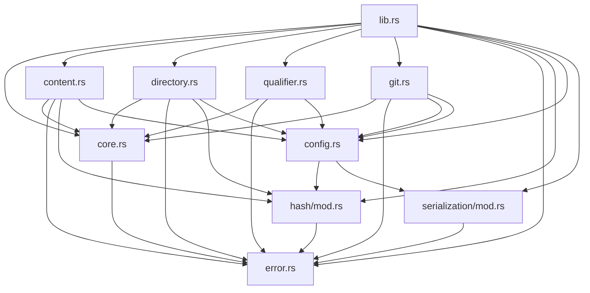

# Developer Guide

## Introduction

This guide is designed for developers who want to contribute to the `swhid-rs` codebase. It provides practical guidance on understanding the architecture, extending functionality, writing tests, and following project conventions.

### Purpose and Audience

This guide complements:
- **README.md**: Quick start and user-facing documentation
- **REFERENCE.md**: Detailed architectural reference and specification mapping

If you're new to the project, start with README.md for an overview, then use this guide for development tasks.

### Prerequisites

- **Rust knowledge**: Intermediate Rust skills (traits, error handling, testing)
- **SWHID specification**: Familiarity with SWHID v1.2 format (see References section)
- **Git**: Basic Git workflow knowledge
- **Cargo**: Understanding of Rust's package manager

### How to Use This Guide

- **New contributors**: Read sections 1-3 to understand the codebase structure
- **Adding features**: See section 5 for step-by-step extension guides
- **Debugging**: See section 8 for common tasks and troubleshooting
- **Reference**: Use section 9 for quick links to related documentation

## Getting Started

### Repository Structure

```
swhid-rs/
├── src/                    # Source code
│   ├── main.rs            # CLI interface
│   ├── lib.rs             # Public API exports
│   ├── core.rs            # Core SWHID types and parsing
│   ├── content.rs         # Content object implementation
│   ├── directory.rs       # Directory object implementation
│   ├── revision.rs        # Revision object implementation
│   ├── release.rs         # Release object implementation
│   ├── snapshot.rs        # Snapshot object implementation
│   ├── qualifier.rs       # Qualified SWHID support
│   ├── error.rs           # Error types
│   ├── config.rs          # HashConfig for v2 support
│   ├── git.rs             # Git integration (feature-gated)
│   ├── hash/              # Hash function abstractions
│   │   ├── mod.rs
│   │   ├── hash_function.rs  # HashFunction trait
│   │   ├── sha1.rs        # SHA1 implementation
│   │   └── sha256.rs      # SHA256 implementation
│   ├── serialization/     # Serialization format abstractions
│   │   ├── mod.rs
│   │   ├── hex.rs         # Hex serializer
│   │   ├── base64.rs      # Base64 and Base64URL serializers
│   │   ├── base32.rs      # Base32 and Base32hex serializers
│   │   └── base85.rs      # Z85 serializer
│   └── utils.rs           # Internal utilities
├── tests/                  # Integration tests
│   ├── content.rs
│   ├── directory.rs
│   ├── revision.rs
│   ├── release.rs
│   ├── snapshot.rs
│   └── git.rs            # Git tests (feature-gated)
├── Cargo.toml            # Project configuration
├── README.md             # User documentation
├── REFERENCE.md          # Architectural reference
└── DEVELOPER_GUIDE.md    # This file
```

### Building the Project

```bash
# Build the library
cargo build

# Build with all features (including Git support)
cargo build --all-features

# Build the CLI binary
cargo build --bin swhid

# Build in release mode
cargo build --release
```

### Running Tests

```bash
# Run all tests
cargo test

# Run tests with Git feature enabled
cargo test --all-features

# Run specific test module
cargo test content::

# Run a specific test
cargo test content_swhid_v1

# Run tests with output
cargo test -- --nocapture
```

### Development Workflow

1. **Create a feature branch**: `git checkout -b feature/your-feature`
2. **Make changes**: Follow code style and conventions (see section 7)
3. **Write tests**: Ensure all new code has tests
4. **Run tests**: `cargo test --all-features`
5. **Check formatting**: `cargo fmt --check`
6. **Check linting**: `cargo clippy`
7. **Commit changes**: Use descriptive commit messages
8. **Submit PR**: Include description of changes and test results

## Codebase Architecture

### Layered Architecture

The `swhid-rs` implementation follows a layered architecture that separates concerns and enables extensibility:

```
┌─────────────────────────────────────────────────────────────┐
│                    CLI Interface (main.rs)                  │
│  - Command parsing (clap)                                   │
│  - User interaction                                          │
│  - HashConfig selection                                     │
├─────────────────────────────────────────────────────────────┤
│                 Public API Layer (lib.rs)                   │
│  - Type exports                                             │
│  - Feature gating                                           │
├─────────────────────────────────────────────────────────────┤
│  Domain Objects                                             │
│  ┌──────────┐  ┌──────────┐  ┌──────────┐  ┌──────────┐  │
│  │ Content  │  │Directory │  │ Revision │  │ Release  │  │
│  │          │  │          │  │          │  │          │  │
│  └──────────┘  └──────────┘  └──────────┘  └──────────┘  │
│  ┌──────────┐  ┌──────────┐                               │
│  │Snapshot │  │Qualified │                               │
│  │          │  │  SWHID   │                               │
│  └──────────┘  └──────────┘                               │
├─────────────────────────────────────────────────────────────┤
│  Abstraction Layer                                          │
│  ┌──────────────┐  ┌──────────────────┐                   │
│  │ HashFunction │  │ DigestSerializer │                   │
│  │   (trait)    │  │     (trait)      │                   │
│  └──────────────┘  └──────────────────┘                   │
│  ┌──────────────┐  ┌──────────────────┐                   │
│  │  HashConfig  │  │   Git Detection  │                   │
│  │   (config)   │  │   (git.rs)       │                   │
│  └──────────────┘  └──────────────────┘                   │
├─────────────────────────────────────────────────────────────┤
│  Core Infrastructure                                         │
│  ┌──────────┐  ┌──────────┐  ┌──────────┐                │
│  │   Core   │  │  Error   │  │  Utils   │                │
│  │ (Swhid)  │  │ Handling │  │          │                │
│  └──────────┘  └──────────┘  └──────────┘                │
└─────────────────────────────────────────────────────────────┘
```

### Key Design Patterns

#### 1. Trait-Based Extensibility

The codebase uses Rust traits to enable extensibility without breaking changes:

**HashFunction Trait** (`src/hash/hash_function.rs`):
```rust
pub trait HashFunction: Send + Sync {
    fn hash(&self, data: &[u8]) -> Vec<u8>;
    fn digest_size(&self) -> usize;
    fn name(&self) -> &str;
}
```

**DigestSerializer Trait** (`src/serialization/mod.rs`):
```rust
pub trait DigestSerializer: Send + Sync {
    fn encode(&self, digest: &[u8]) -> String;
    fn decode(&self, encoded: &str) -> Result<Vec<u8>, SwhidError>;
    fn name(&self) -> &str;
}
```

These traits allow adding new hash functions and serialization formats without modifying existing code.

#### 2. Configuration Pattern

`HashConfig` bundles a hash function and serializer together:

```rust
pub struct HashConfig {
    pub hash_function: Box<dyn HashFunction>,
    pub serializer: Box<dyn DigestSerializer>,
    pub version: String,
}
```

This pattern:
- Encapsulates version-specific behavior
- Enables runtime configuration
- Maintains backward compatibility

#### 3. Backward Compatibility Strategy

- **v1 API preserved**: All existing `swhid()` methods still work
- **v2 via config**: New `swhid_with_config()` methods for v2
- **Default behavior**: v1 remains the default
- **Version detection**: Git integration auto-detects repository hash algorithm

#### 4. Error Handling Approach

Centralized error type (`SwhidError` in `src/error.rs`):
- Uses `thiserror` for ergonomic error handling
- All errors are `Send + Sync` for async compatibility
- Clear error messages for debugging

### Module Dependencies



### Module Organization

**Public Modules** (exported in `lib.rs`):
- `content`: Content object implementation
- `directory`: Directory object implementation
- `revision`: Revision object implementation
- `release`: Release object implementation
- `snapshot`: Snapshot object implementation
- `qualifier`: Qualified SWHID support
- `core`: Core SWHID types (`Swhid`, `ObjectType`)
- `config`: Hash configuration for v2
- `git`: Git integration (feature-gated)

**Internal Modules**:
- `hash`: Hash function implementations
- `serialization`: Serialization format implementations
- `error`: Error types
- `utils`: Internal utilities

**Feature Gating**:
- `git`: Git integration (`#[cfg(feature = "git")]`)
- `serde`: Serialization support (`#[cfg(feature = "serde")]`)

## Core Concepts

### SWHID Versions

The codebase supports two SWHID versions:

**Version 1 (v1)**:
- Hash function: SHA1 (20 bytes)
- Serialization: Hex (40 characters)
- Format: `swh:1:<object-type>:<40-char-hex>`
- Default for backward compatibility

**Version 2 (v2)**:
- Hash function: SHA256 (32 bytes)
- Serialization: Configurable (hex, base64, base64url, base32, base32hex, z85)
- Format: `swh:2:<object-type>:<variable-length-encoded>`
- Experimental, enables future extensibility

**Version Detection**:
- Git integration automatically detects repository hash algorithm
- CLI allows explicit version selection via `--version` flag
- Library API uses `HashConfig` to specify version

### Hash Functions

The `HashFunction` trait (`src/hash/hash_function.rs`) abstracts hash computation:

```rust
pub trait HashFunction: Send + Sync {
    fn hash(&self, data: &[u8]) -> Vec<u8>;
    fn digest_size(&self) -> usize;
    fn name(&self) -> &str;
}
```

**Current Implementations**:

1. **SHA1** (`src/hash/sha1.rs`):
   - Uses `sha1collisiondetection` crate
   - 20-byte digests
   - Used for v1 SWHIDs

2. **SHA256** (`src/hash/sha256.rs`):
   - Uses `sha2` crate
   - 32-byte digests
   - Used for v2 SWHIDs

**How to Add a New Hash Function**:

1. Create new file: `src/hash/sha3.rs` (example)
2. Implement `HashFunction` trait
3. Add module to `src/hash/mod.rs`
4. Export in `src/hash/mod.rs`
5. Add factory method to `HashConfig` (see section 5.1)

### Serialization Formats

The `DigestSerializer` trait (`src/serialization/mod.rs`) abstracts digest encoding:

```rust
pub trait DigestSerializer: Send + Sync {
    fn encode(&self, digest: &[u8]) -> String;
    fn decode(&self, encoded: &str) -> Result<Vec<u8>, SwhidError>;
    fn name(&self) -> &str;
}
```

**Current Implementations**:

1. **Hex** (`src/serialization/hex.rs`):
   - Standard hexadecimal encoding
   - 40 chars for SHA1, 64 chars for SHA256
   - Default for v1 and v2 (hex variant)

2. **Base64** (`src/serialization/base64.rs`):
   - Standard Base64 with padding
   - 28 chars for SHA1, 44 chars for SHA256
   - URL-safe variant available (Base64URL)

3. **Base32** (`src/serialization/base32.rs`):
   - RFC 4648 Base32 encoding
   - 32 chars for SHA1, 52 chars for SHA256
   - Base32hex variant available

4. **Z85** (`src/serialization/base85.rs`):
   - ZeroMQ Base85 encoding
   - 25 chars for SHA1, 40 chars for SHA256
   - Most compact format

**Compactness Comparison** (for SHA256):
- Z85: 40 characters (most compact)
- Base64URL: 43 characters
- Base64: 44 characters
- Base32/Base32hex: 52 characters
- Hex: 64 characters (least compact)

### Object Types

SWHID supports five object types (defined in `src/core.rs`):

1. **Content** (`cnt`): File contents (Git blob equivalent)
2. **Directory** (`dir`): Directory structure (Git tree equivalent)
3. **Revision** (`rev`): VCS commit/changeset
4. **Release** (`rel`): VCS annotated tag/release
5. **Snapshot** (`snp`): Snapshot of repository references

Each object type has:
- A struct representing the object data
- A `swhid()` method for v1 computation
- A `swhid_with_config()` method for v2 computation
- Manifest generation logic (for complex objects)

### HashConfig

`HashConfig` (`src/config.rs`) bundles hash function and serializer:

```rust
pub struct HashConfig {
    pub hash_function: Box<dyn HashFunction>,
    pub serializer: Box<dyn DigestSerializer>,
    pub version: String,
}
```

**Factory Methods**:
- `HashConfig::v1()`: SHA1 + hex
- `HashConfig::v2_sha256_hex()`: SHA256 + hex
- `HashConfig::v2_sha256_base64()`: SHA256 + base64
- `HashConfig::v2_sha256_base64url()`: SHA256 + base64url
- `HashConfig::v2_sha256_base32()`: SHA256 + base32
- `HashConfig::v2_sha256_base32hex()`: SHA256 + base32hex
- `HashConfig::v2_sha256_z85()`: SHA256 + z85

**Usage Pattern**:
```rust
let config = HashConfig::v2_sha256_z85();
let swhid = content.swhid_with_config(&config);
```

## Extending the Codebase

### Adding a New Hash Function

**Example: Adding SHA3-256**

1. **Create implementation file** (`src/hash/sha3.rs`):
```rust
use crate::hash::HashFunction;
use sha3::{Sha3_256, Digest};

pub struct Sha3Hash;

impl Sha3Hash {
    pub fn new() -> Self {
        Self
    }
}

impl HashFunction for Sha3Hash {
    fn hash(&self, data: &[u8]) -> Vec<u8> {
        let mut hasher = Sha3_256::new();
        hasher.update(data);
        hasher.finalize().to_vec()
    }

    fn digest_size(&self) -> usize {
        32
    }

    fn name(&self) -> &str {
        "sha3-256"
    }
}
```

2. **Add module to** `src/hash/mod.rs`:
```rust
pub mod sha3;
pub use sha3::Sha3Hash;
```

3. **Add dependency to** `Cargo.toml`:
```toml
sha3 = "0.10"
```

4. **Add factory method to** `HashConfig` (`src/config.rs`):
```rust
pub fn v2_sha3_256_hex() -> Self {
    Self::new(
        Box::new(Sha3Hash::new()),
        Box::new(HexSerializer::new()),
        "2".to_string(),
    )
}
```

5. **Update CLI validation** (`src/main.rs`):
```rust
// In get_hash_config function, add:
("2", "sha3-256", "hex") => Ok(HashConfig::v2_sha3_256_hex()),
```

6. **Add tests** (in `src/hash/sha3.rs` or `tests/`):
```rust
#[cfg(test)]
mod tests {
    use super::*;
    use crate::hash::HashFunction;

    #[test]
    fn sha3_hash_basic() {
        let hasher = Sha3Hash::new();
        let digest = hasher.hash(b"test");
        assert_eq!(digest.len(), 32);
    }
}
```

### Adding a New Serialization Format

**Example: Adding Base58**

1. **Create implementation file** (`src/serialization/base58.rs`):
```rust
use crate::error::SwhidError;
use super::DigestSerializer;
// Use bs58 crate or implement manually

pub struct Base58Serializer;

impl Base58Serializer {
    pub fn new() -> Self {
        Self
    }
}

impl DigestSerializer for Base58Serializer {
    fn encode(&self, digest: &[u8]) -> String {
        bs58::encode(digest).into_string()
    }

    fn decode(&self, encoded: &str) -> Result<Vec<u8>, SwhidError> {
        bs58::decode(encoded)
            .into_vec()
            .map_err(|e| SwhidError::InvalidDigest(format!("Invalid base58: {e}")))
    }

    fn name(&self) -> &str {
        "base58"
    }
}
```

2. **Add module to** `src/serialization/mod.rs`:
```rust
pub mod base58;
pub use base58::Base58Serializer;
```

3. **Add dependency to** `Cargo.toml`:
```toml
bs58 = "0.5"
```

4. **Add factory method to** `HashConfig`:
```rust
pub fn v2_sha256_base58() -> Self {
    Self::new(
        Box::new(Sha256Hash::new()),
        Box::new(Base58Serializer::new()),
        "2".to_string(),
    )
}
```

5. **Update CLI validation** (`src/main.rs`):
```rust
// In get_hash_config function, add "base58" to serialization validation
// and add match arm:
("2", "sha256", "base58") => Ok(HashConfig::v2_sha256_base58()),
```

6. **Add tests**:
```rust
#[cfg(test)]
mod tests {
    use super::*;

    #[test]
    fn base58_roundtrip() {
        let serializer = Base58Serializer::new();
        let data = vec![0x12, 0x34, 0x56, 0x78];
        let encoded = serializer.encode(&data);
        let decoded = serializer.decode(&encoded).unwrap();
        assert_eq!(data, decoded);
    }
}
```

### Adding a New Object Type

**Example: Adding a "Bundle" object type**

1. **Add to** `ObjectType` enum (`src/core.rs`):
```rust
pub enum ObjectType {
    Content,
    Directory,
    Revision,
    Release,
    Snapshot,
    Bundle, // New type
}
```

2. **Update** `as_tag()` and `from_tag()` methods

3. **Create object struct** (`src/bundle.rs`):
```rust
use crate::{Swhid, HashConfig};
use crate::hash::hash_swhid_object_with;

pub struct Bundle {
    // Define bundle fields
}

impl Bundle {
    pub fn swhid(&self) -> Swhid {
        let manifest = bundle_manifest(self);
        let digest = hash_swhid_object("bundle", &manifest);
        Swhid::new_v1(crate::ObjectType::Bundle, digest)
    }

    pub fn swhid_with_config(&self, config: &HashConfig) -> Swhid {
        let manifest = bundle_manifest(self);
        let digest = hash_swhid_object_with("bundle", &manifest, config.hash_function.as_ref());
        Swhid::new(crate::ObjectType::Bundle, digest, config.version.clone())
    }
}

fn bundle_manifest(bundle: &Bundle) -> Vec<u8> {
    // Generate manifest bytes
    todo!()
}
```

4. **Export in** `src/lib.rs`:
```rust
pub mod bundle;
pub use bundle::Bundle;
```

5. **Add tests** (`tests/bundle.rs`):
```rust
use swhid::bundle::*;

#[test]
fn bundle_swhid_v1() {
    let bundle = Bundle::new(/* ... */);
    let swhid = bundle.swhid();
    assert_eq!(swhid.version(), "1");
}
```

### Modifying Git Integration

**Git Hash Algorithm Detection** (`src/git.rs`):

The `detect_repo_hash_algorithm()` function checks OID length:
- 20 bytes → SHA1
- 32 bytes → SHA256

**Adding Support for Other VCS Systems**:

1. Create new module: `src/hg.rs` (for Mercurial, example)
2. Follow Git integration pattern:
   - Repository opening
   - Object extraction
   - SWHID computation
3. Feature-gate if needed: `#[cfg(feature = "hg")]`
4. Add CLI subcommand if appropriate

## Testing Strategy

### Test Organization

**Unit Tests**:
- Located in each module file (`#[cfg(test)] mod tests`)
- Test individual functions and methods
- Example: `src/content.rs` contains content-specific tests

**Integration Tests**:
- Located in `tests/` directory
- Test end-to-end functionality
- Example: `tests/content.rs` tests Content SWHID computation

**Feature-Gated Tests**:
- Use `#[cfg(feature = "git")]` for Git-specific tests
- Example: `tests/git.rs` only compiles with `--features git`

### Writing Tests

**Test Patterns**:

1. **Roundtrip Tests**: Verify encoding/decoding works correctly
```rust
#[test]
fn serializer_roundtrip() {
    let serializer = Base64Serializer::new();
    let data = vec![0x12, 0x34, 0x56];
    let encoded = serializer.encode(&data);
    let decoded = serializer.decode(&encoded).unwrap();
    assert_eq!(data, decoded);
}
```

2. **Version Compatibility Tests**: Verify v1 and v2 produce different but valid results
```rust
#[test]
fn v1_vs_v2_different() {
    let content = Content::from_bytes(b"test");
    let v1 = content.swhid();
    let v2 = content.swhid_with_config(&HashConfig::v2_sha256_hex());
    
    assert_eq!(v1.version(), "1");
    assert_eq!(v2.version(), "2");
    assert_ne!(v1.digest_bytes(), v2.digest_bytes());
}
```

3. **Consistency Tests**: Verify same input produces same output
```rust
#[test]
fn hash_consistency() {
    let data = b"test";
    let hash1 = hash_content(data);
    let hash2 = hash_content(data);
    assert_eq!(hash1, hash2);
}
```

4. **Error Case Tests**: Verify proper error handling
```rust
#[test]
fn invalid_swhid_parse() {
    assert!("invalid".parse::<Swhid>().is_err());
}
```

### Running Tests

```bash
# All tests
cargo test

# With features
cargo test --all-features

# Specific test
cargo test content_swhid_v1

# With output
cargo test -- --nocapture

# Single test file
cargo test --test content
```

### Test Coverage Goals

- **Unit tests**: Cover all public methods
- **Integration tests**: Cover all CLI commands
- **Error cases**: Test all error paths
- **Edge cases**: Empty inputs, large inputs, unicode, etc.

## Code Style and Conventions

### Rust Formatting

Use `rustfmt` for consistent formatting:
```bash
cargo fmt
cargo fmt --check  # CI check
```

### Documentation Standards

- **Public APIs**: Must have doc comments
- **Examples**: Include in doc comments where helpful
- **Error types**: Document when each error occurs

Example:
```rust
/// Compute a SWHID v1.2 content identifier.
///
/// This implements the SWHID v1.2 content hashing algorithm,
/// creating a `swh:1:cnt:<digest>` identifier.
///
/// # Examples
///
/// ```
/// use swhid::Content;
/// let content = Content::from_bytes(b"Hello");
/// let swhid = content.swhid();
/// ```
pub fn swhid(&self) -> Swhid {
    // ...
}
```

### Error Message Conventions

- Use clear, actionable error messages
- Include context (what operation failed, why)
- Use `thiserror` for structured errors

### Commit Message Guidelines

Follow conventional commits:
- `feat: Add SHA3 hash function support`
- `fix: Correct Base32 padding handling`
- `docs: Update developer guide with examples`
- `test: Add integration tests for v2 serialization`

## Common Tasks

### Debugging SWHID Computation

**Enable Debug Output**:
```rust
let content = Content::from_bytes(b"test");
let swhid = content.swhid();
eprintln!("Debug: {:?}", swhid);
eprintln!("Digest hex: {}", swhid.digest_hex());
```

**Compare with Reference Implementation**:
- Use Software Heritage's Python implementation
- Compare manifest bytes
- Verify hash computation step-by-step

### Performance Considerations

**Zero-Copy Patterns**:
- Use `&[u8]` instead of `Vec<u8>` where possible
- Use `Cow<[u8]>` for borrowed/owned flexibility

**Memory Allocation**:
- Pre-allocate vectors with known capacity
- Use `Box<[u8]>` for fixed-size byte arrays

**Benchmarking**:
```bash
cargo bench
```

### Backward Compatibility

**Ensuring v1 Compatibility**:
- All existing `swhid()` methods must continue to work
- v1 SWHIDs must parse correctly
- Git integration must detect SHA1 repos correctly

**Migration Strategies**:
- v2 is opt-in (via `swhid_with_config()`)
- Default behavior remains v1
- No breaking changes to public API

## Reference Links

### SWHID Specification
- [SWHID v1.2 Specification](https://docs.softwareheritage.org/devel/swh-model/persistent-identifiers.html)
- [ISO/IEC 18670:2025](https://www.iso.org/standard/78952.html)

### Related Documentation
- **README.md**: User-facing documentation and quick start
- **REFERENCE.md**: Detailed architectural reference
- **TUTORIAL.md**: User tutorial with CLI examples

### External Dependencies
- [clap](https://docs.rs/clap/): CLI argument parsing
- [git2](https://docs.rs/git2/): Git repository access
- [sha2](https://docs.rs/sha2/): SHA256 hashing
- [sha1collisiondetection](https://docs.rs/sha1collisiondetection/): SHA1 hashing

### Contributing
- Follow Rust community guidelines
- Write tests for all new features
- Update documentation
- Ensure backward compatibility


